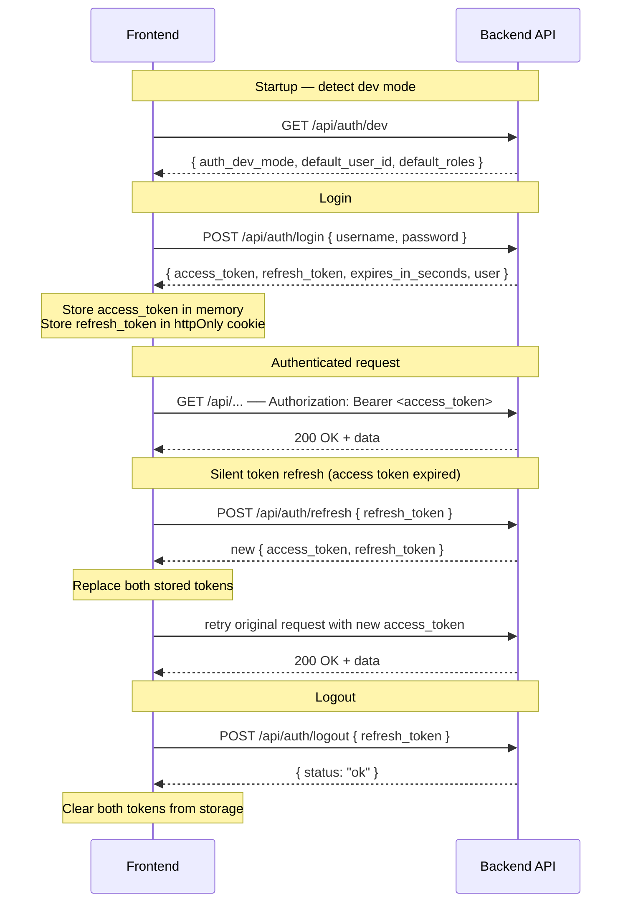

# ComfyUI Wrapper Backend (MVP)

This is a sibling backend for ComfyUI. It does not modify ComfyUI.

## What you get
- FastAPI API gateway (jobs, workflows, assets, review, export)
- Simple worker loop (polls DB, submits to ComfyUI)
- SQLite DB (Postgres-compatible schema)

## Run (dev)

1. Create a virtualenv and install deps with `uv`:

```bash
uv sync
```

2. Create env file:

```bash
cp .env.example .env
```

3. Seed everything (roles, system user, default workflows, admin user):

```bash
uv run python -m app.seed
```

You can also seed optional role users via `.env`:
- `WORKFLOW_CREATOR_USER_NAME` / `WORKFLOW_CREATOR_USER_PASSWORD`
- `JOB_CREATOR_USER_NAME` / `JOB_CREATOR_USER_PASSWORD`
- `VIEWER_USER_NAME` / `VIEWER_USER_PASSWORD`
- `MODERATOR_USER_NAME` / `MODERATOR_USER_PASSWORD`

4. Start the API:

```bash
uv run uvicorn app.main:app --reload --port 8000
```

5. Start the worker:

```bash
uv run python -m app.worker
```

## Authentication flow



## Notes
- JWT auth is enabled (`/api/auth/login`, `/api/auth/refresh`, `/api/auth/logout`, `/api/auth/me`).
- Access token lifetime is controlled by `AUTH_ACCESS_TOKEN_TTL_MINUTES` in `backend/.env` (default `60`).
- Development override is available via `AUTH_DEV_MODE=true` for faster local iteration.
- Seeder command reads `USER_NAME` and `USER_PASSWORD` from `.env` (or environment variables).
- Optional headers:
  - `x-user-id: <user-id>`
  - `x-user-roles: admin,workflow_creator,job_creator,viewer,moderator`
- ComfyUI base URL defaults to http://127.0.0.1:8188
- Storage root defaults to /data/app
- The Text→Audio workflow template is loaded from `prompts/audio_stable_audio_example.json`.
- Docs:
  - `docs/AUTHENTICATION.md` — full auth system reference (backend)
  - `docs/auth-frontend-integration.md` — frontend integration guide with TypeScript reference implementation
