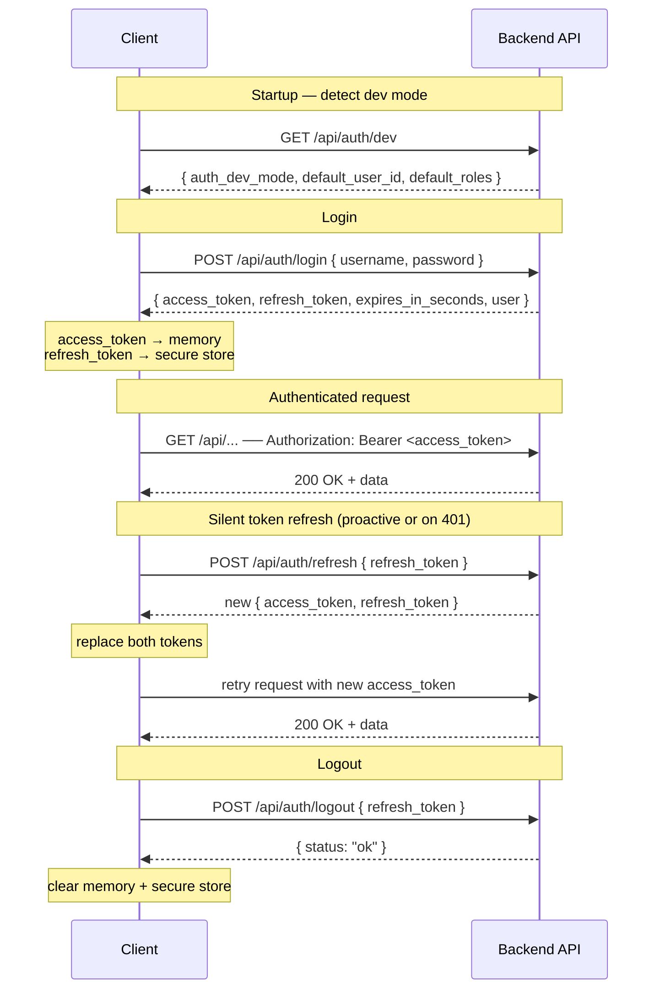

# Client Authentication Integration Guide

This document is a complete, self-contained reference for implementing authentication
against the ComfyUI Wrapper Backend from any client platform. It covers all types,
endpoint contracts, platform-specific storage strategies, and reference implementations
for Web (TypeScript), Flutter/Dart, and Unreal Engine (C++).

Reading this file is sufficient to implement a fully working auth client on any of those
platforms.

---

## How the system works

All concepts below apply identically on every platform.

- **Access token** — short-lived JWT (default 60 min). Sent as
  `Authorization: Bearer <token>` on every authenticated API call. Keep in memory only;
  never write to disk.
- **Refresh token** — long-lived opaque random string (default 14 days). Used only to
  obtain a new token pair via `POST /api/auth/refresh`. Each use immediately revokes the
  submitted token and issues a new one (rotation). Store in the platform's secure
  credential store so it survives process restart.
- **Dev mode** — when `auth_dev_mode: true` (returned by `GET /api/auth/dev`), the
  server accepts requests without a JWT. Identity is taken from `X-User-Id` /
  `X-User-Roles` request headers, or falls back to server-configured defaults.
  **Never enable in production.**

---

## Flow diagram



---

## Data model

All JSON field names are snake_case as returned by the API.

### User identity — returned by `/login`, `/refresh`, and `/me`

| Field | Type | Description |
|---|---|---|
| `id` | string | UUID of the user |
| `username` | string | Display name |
| `roles` | string[] | Lowercase role names, e.g. `["job_creator", "viewer"]` |

### Token response — returned by `/login` and `/refresh`

| Field | Type | Description |
|---|---|---|
| `access_token` | string | JWT — send as `Authorization: Bearer` header |
| `token_type` | `"bearer"` | Always `"bearer"` |
| `expires_in_seconds` | integer | Lifetime of `access_token` in seconds (default 3600) |
| `refresh_token` | string | Opaque token — store securely, rotate on every use |
| `user` | User object | Identity of the authenticated user |

### Dev status — returned by `/api/auth/dev`

| Field | Type | Description |
|---|---|---|
| `auth_dev_mode` | boolean | Whether dev bypass is active |
| `default_user_id` | string \| null | Default user ID used when no headers are sent |
| `default_roles` | string[] \| null | Default roles used when no headers are sent |

---

## Endpoints

Base URL: `http://<host>:8000` (adjust for your deployment).

All request bodies are `application/json`. All responses are `application/json`.

### `GET /api/auth/dev`

No auth required. Call this on startup to detect dev mode.

Response `200`:
```json
{ "auth_dev_mode": false, "default_user_id": null, "default_roles": null }
```

---

### `POST /api/auth/login`

Authenticate with username + password. Rate-limited to **10 requests/minute** per IP.

Request:
```json
{ "username": "alice", "password": "secret" }
```

Response `200` → Token response

Errors:
- `401` — wrong credentials
- `429` — rate limit exceeded

---

### `POST /api/auth/refresh`

Exchange a valid refresh token for a new token pair. The submitted token is revoked
immediately; reuse returns `401`.

Request:
```json
{ "refresh_token": "<opaque>" }
```

Response `200` → Token response

Errors:
- `401` — token not found, already revoked, or expired

---

### `POST /api/auth/logout`

Revoke a refresh token. Idempotent — always returns `200` even if the token is unknown
or already revoked.

Request:
```json
{ "refresh_token": "<opaque>" }
```

Response `200`:
```json
{ "status": "ok" }
```

---

### `GET /api/auth/me`

Return the currently authenticated user. Useful for validating a restored session on
startup.

```
Authorization: Bearer <access_token>
```

Response `200` → User identity object

Errors:
- `401` — missing, invalid, or expired access token

---

## Token storage by platform

The access token should **always** live in memory only — it is short-lived and there is
no benefit to persisting it. The refresh token must survive process restart, so it needs
a durable secure store.

| Platform | Secure storage for refresh token |
|---|---|
| **Web (browser)** | `httpOnly` cookie set by a BFF/server-side proxy — JS cannot read it. For internal tooling with no BFF, `sessionStorage` (tab-scoped) is acceptable; avoid `localStorage` in production. |
| **Flutter (iOS)** | `flutter_secure_storage` → backed by **Keychain** |
| **Flutter (Android)** | `flutter_secure_storage` → backed by **Keystore / EncryptedSharedPreferences** |
| **Unreal Engine** | `FPlatformMisc::SetStoredValue` / `GetStoredValue` → backed by **Keychain** (macOS/iOS), **Credential Manager** (Windows), **Keystore** (Android) |
| **iOS native (Swift)** | `Security` framework — `SecItemAdd` / `SecItemCopyMatching` (Keychain) |
| **Android native (Kotlin)** | `EncryptedSharedPreferences` with `MasterKey` |
| **Desktop (non-UE)** | OS credential store via `keytar` (Node), `secret-service` (Linux), `Keychain` (macOS), `Credential Manager` (Windows) |

---

## Core logic (platform-agnostic pseudocode)

The same three patterns apply on every platform.

**Proactive refresh** — before the access token expires, fetch a new pair silently:
```
if now + 60s >= expiresAt:
    doRefresh(storedRefreshToken)
```

**Reactive refresh** — if a `401` is received on a normal API call:
```
response = apiCall(request)
if response.status == 401:
    try:
        doRefresh(storedRefreshToken)
        response = apiCall(request)   // retry once
    except:
        clearSession()
        showLoginScreen()
```

**Concurrent refresh coalescing** — if multiple requests race to refresh at the same
time, only one refresh request should be issued; the others must wait for it:
```
if refreshInFlight:
    wait for refreshInFlight
else:
    refreshInFlight = doRefresh(...)
    await refreshInFlight
    refreshInFlight = null
```

---

## Reference implementation: Web (TypeScript)

```ts
const API_BASE = "http://localhost:8000";

interface AuthUser {
  id: string;
  username: string;
  roles: string[];
}

interface TokenResponse {
  access_token: string;
  token_type: "bearer";
  expires_in_seconds: number;
  refresh_token: string;
  user: AuthUser;
}

interface AuthState {
  accessToken: string;
  refreshToken: string;
  expiresAt: Date;
  user: AuthUser;
}

let auth: AuthState | null = null;
let refreshPromise: Promise<AuthState> | null = null;

export async function login(username: string, password: string): Promise<AuthUser> {
  const res = await fetch(`${API_BASE}/api/auth/login`, {
    method: "POST",
    headers: { "Content-Type": "application/json" },
    body: JSON.stringify({ username, password }),
  });
  if (!res.ok) throw new AuthError(res.status, await res.text());
  const data: TokenResponse = await res.json();
  auth = toState(data);
  persistRefreshToken(auth.refreshToken);
  return data.user;
}

export async function logout(): Promise<void> {
  if (!auth) return;
  await fetch(`${API_BASE}/api/auth/logout`, {
    method: "POST",
    headers: { "Content-Type": "application/json" },
    body: JSON.stringify({ refresh_token: auth.refreshToken }),
  });
  auth = null;
  clearRefreshToken();
}

export async function restoreSession(): Promise<AuthUser | null> {
  const stored = loadRefreshToken();
  if (!stored) return null;
  try {
    auth = await doRefresh(stored);
    return auth.user;
  } catch {
    clearRefreshToken();
    return null;
  }
}

export async function apiFetch(path: string, init: RequestInit = {}): Promise<Response> {
  const token = await getValidAccessToken();
  const res = await fetch(`${API_BASE}${path}`, {
    ...init,
    headers: { ...init.headers, Authorization: `Bearer ${token}` },
  });
  if (res.status === 401) {
    try {
      const freshToken = await silentRefresh();
      return fetch(`${API_BASE}${path}`, {
        ...init,
        headers: { ...init.headers, Authorization: `Bearer ${freshToken}` },
      });
    } catch {
      auth = null;
      clearRefreshToken();
      throw new AuthError(401, "Session expired — please log in again");
    }
  }
  return res;
}

async function getValidAccessToken(): Promise<string> {
  if (!auth) throw new AuthError(401, "Not authenticated");
  if (auth.expiresAt <= new Date(Date.now() + 60_000)) {
    auth = await silentRefresh();
  }
  return auth.accessToken;
}

function silentRefresh(): Promise<AuthState> {
  if (refreshPromise) return refreshPromise;
  if (!auth) return Promise.reject(new AuthError(401, "Not authenticated"));
  refreshPromise = doRefresh(auth.refreshToken).finally(() => { refreshPromise = null; });
  return refreshPromise;
}

async function doRefresh(refreshToken: string): Promise<AuthState> {
  const res = await fetch(`${API_BASE}/api/auth/refresh`, {
    method: "POST",
    headers: { "Content-Type": "application/json" },
    body: JSON.stringify({ refresh_token: refreshToken }),
  });
  if (!res.ok) throw new AuthError(res.status, await res.text());
  const data: TokenResponse = await res.json();
  const state = toState(data);
  persistRefreshToken(state.refreshToken);
  return state;
}

function toState(data: TokenResponse): AuthState {
  return {
    accessToken: data.access_token,
    refreshToken: data.refresh_token,
    expiresAt: new Date(Date.now() + data.expires_in_seconds * 1000),
    user: data.user,
  };
}

// Storage — swap for httpOnly cookie logic if you have a BFF
const KEY = "comfyui_refresh_token";
function persistRefreshToken(t: string) { sessionStorage.setItem(KEY, t); }
function loadRefreshToken(): string | null { return sessionStorage.getItem(KEY); }
function clearRefreshToken() { sessionStorage.removeItem(KEY); }

export class AuthError extends Error {
  constructor(public readonly status: number, message: string) {
    super(message);
    this.name = "AuthError";
  }
}
```

---

## Reference implementation: Flutter (Dart)

Requires: `http`, `flutter_secure_storage` packages.

```dart
import 'dart:convert';
import 'package:flutter_secure_storage/flutter_secure_storage.dart';
import 'package:http/http.dart' as http;

class AuthUser {
  final String id;
  final String username;
  final List<String> roles;
  AuthUser({required this.id, required this.username, required this.roles});
  factory AuthUser.fromJson(Map<String, dynamic> j) => AuthUser(
    id: j['id'] as String,
    username: j['username'] as String,
    roles: List<String>.from(j['roles'] as List),
  );
}

class _TokenResponse {
  final String accessToken;
  final String refreshToken;
  final int expiresInSeconds;
  final AuthUser user;
  _TokenResponse({
    required this.accessToken,
    required this.refreshToken,
    required this.expiresInSeconds,
    required this.user,
  });
  factory _TokenResponse.fromJson(Map<String, dynamic> j) => _TokenResponse(
    accessToken: j['access_token'] as String,
    refreshToken: j['refresh_token'] as String,
    expiresInSeconds: j['expires_in_seconds'] as int,
    user: AuthUser.fromJson(j['user'] as Map<String, dynamic>),
  );
}

class AuthClient {
  final String baseUrl;
  final _storage = const FlutterSecureStorage();
  static const _storageKey = 'comfyui_refresh_token';

  String? _accessToken;
  String? _refreshToken;
  DateTime? _expiresAt;
  AuthUser? currentUser;
  Future<void>? _refreshFuture;

  AuthClient({required this.baseUrl});

  Future<Map<String, dynamic>> getDevStatus() async {
    final res = await http.get(Uri.parse('$baseUrl/api/auth/dev'));
    return jsonDecode(res.body) as Map<String, dynamic>;
  }

  Future<AuthUser> login(String username, String password) async {
    final res = await http.post(
      Uri.parse('$baseUrl/api/auth/login'),
      headers: {'Content-Type': 'application/json'},
      body: jsonEncode({'username': username, 'password': password}),
    );
    if (res.statusCode != 200) throw AuthException(res.statusCode, res.body);
    final data = _TokenResponse.fromJson(jsonDecode(res.body) as Map<String, dynamic>);
    _apply(data);
    await _storage.write(key: _storageKey, value: data.refreshToken);
    return data.user;
  }

  Future<AuthUser?> restoreSession() async {
    final stored = await _storage.read(key: _storageKey);
    if (stored == null) return null;
    try {
      await _doRefresh(stored);
      return currentUser;
    } catch (_) {
      await _storage.delete(key: _storageKey);
      return null;
    }
  }

  Future<void> logout() async {
    final token = _refreshToken;
    _clear();
    await _storage.delete(key: _storageKey);
    if (token == null) return;
    await http.post(
      Uri.parse('$baseUrl/api/auth/logout'),
      headers: {'Content-Type': 'application/json'},
      body: jsonEncode({'refresh_token': token}),
    );
  }

  // Use this for all authenticated API calls
  Future<http.Response> apiGet(String path) => _apiRequest(() =>
      http.get(Uri.parse('$baseUrl$path'),
          headers: {'Authorization': 'Bearer $_accessToken'}));

  Future<http.Response> apiPost(String path, Map<String, dynamic> body) =>
      _apiRequest(() => http.post(
            Uri.parse('$baseUrl$path'),
            headers: {
              'Content-Type': 'application/json',
              'Authorization': 'Bearer $_accessToken',
            },
            body: jsonEncode(body),
          ));

  Future<http.Response> _apiRequest(
      Future<http.Response> Function() request) async {
    await _ensureValidToken();
    final res = await request();
    if (res.statusCode == 401) {
      try {
        await _silentRefresh();
        return request();
      } catch (_) {
        _clear();
        await _storage.delete(key: _storageKey);
        throw AuthException(401, 'Session expired');
      }
    }
    return res;
  }

  Future<void> _ensureValidToken() async {
    if (_accessToken == null) throw AuthException(401, 'Not authenticated');
    if (_expiresAt!.isBefore(DateTime.now().add(const Duration(seconds: 60)))) {
      await _silentRefresh();
    }
  }

  Future<void> _silentRefresh() {
    _refreshFuture ??= _doRefresh(_refreshToken!)
        .whenComplete(() => _refreshFuture = null);
    return _refreshFuture!;
  }

  Future<void> _doRefresh(String refreshToken) async {
    final res = await http.post(
      Uri.parse('$baseUrl/api/auth/refresh'),
      headers: {'Content-Type': 'application/json'},
      body: jsonEncode({'refresh_token': refreshToken}),
    );
    if (res.statusCode != 200) throw AuthException(res.statusCode, res.body);
    final data = _TokenResponse.fromJson(jsonDecode(res.body) as Map<String, dynamic>);
    _apply(data);
    await _storage.write(key: _storageKey, value: data.refreshToken);
  }

  void _apply(_TokenResponse data) {
    _accessToken = data.accessToken;
    _refreshToken = data.refreshToken;
    _expiresAt = DateTime.now().add(Duration(seconds: data.expiresInSeconds));
    currentUser = data.user;
  }

  void _clear() {
    _accessToken = null;
    _refreshToken = null;
    _expiresAt = null;
    currentUser = null;
  }
}

class AuthException implements Exception {
  final int statusCode;
  final String message;
  AuthException(this.statusCode, this.message);
  @override
  String toString() => 'AuthException($statusCode): $message';
}
```

---

## Reference implementation: Unreal Engine (C++)

Unreal's `FHttpModule` is callback-based. The pattern below stores the refresh token via
`FPlatformMisc::SetStoredValue`, which maps to the platform's native credential store
(Keychain on macOS/iOS, Credential Manager on Windows, Keystore on Android).

```cpp
// AuthClient.h
#pragma once
#include "CoreMinimal.h"
#include "HttpModule.h"
#include "Interfaces/IHttpRequest.h"
#include "Interfaces/IHttpResponse.h"
#include "Dom/JsonObject.h"
#include "Serialization/JsonSerializer.h"

DECLARE_DELEGATE_OneParam(FOnAuthSuccess, FString /*Username*/);
DECLARE_DELEGATE_OneParam(FOnAuthFailure, int32 /*HttpStatus*/);

class YOURGAME_API FAuthClient
{
public:
    explicit FAuthClient(const FString& InBaseUrl) : BaseUrl(InBaseUrl) {}

    // Call on startup — fires OnSuccess with username if restored, OnFailure otherwise
    void RestoreSession(FOnAuthSuccess OnSuccess, FOnAuthFailure OnFailure);
    void Login(const FString& Username, const FString& Password,
               FOnAuthSuccess OnSuccess, FOnAuthFailure OnFailure);
    void Logout();

    // Attach Authorization header — call before sending any authenticated request
    // Returns false if not authenticated; caller should trigger login
    bool AttachAuthHeader(TSharedRef<IHttpRequest> Request);

private:
    FString BaseUrl;
    FString AccessToken;
    FString RefreshToken;
    FDateTime ExpiresAt = FDateTime(0);

    static const FString StorageSection;  // = TEXT("ComfyUI")
    static const FString StorageKey;      // = TEXT("RefreshToken")

    void DoRefresh(FOnAuthSuccess OnSuccess, FOnAuthFailure OnFailure);
    void ApplyTokenResponse(const TSharedPtr<FJsonObject>& Json);
    void PersistRefreshToken(const FString& Token);
    FString LoadRefreshToken();
    void ClearRefreshToken();
    bool IsTokenExpiringSoon() const;
};


// AuthClient.cpp
const FString FAuthClient::StorageSection = TEXT("ComfyUI");
const FString FAuthClient::StorageKey     = TEXT("RefreshToken");

void FAuthClient::Login(const FString& Username, const FString& Password,
                        FOnAuthSuccess OnSuccess, FOnAuthFailure OnFailure)
{
    const FString Body = FString::Printf(
        TEXT("{\"username\":\"%s\",\"password\":\"%s\"}"), *Username, *Password);

    auto Req = FHttpModule::Get().CreateRequest();
    Req->SetURL(BaseUrl + TEXT("/api/auth/login"));
    Req->SetVerb(TEXT("POST"));
    Req->SetHeader(TEXT("Content-Type"), TEXT("application/json"));
    Req->SetContentAsString(Body);
    Req->OnProcessRequestComplete().BindLambda(
        [this, OnSuccess, OnFailure](FHttpRequestPtr, FHttpResponsePtr Res, bool bOk)
        {
            if (!bOk || !Res || Res->GetResponseCode() != 200)
            {
                OnFailure.ExecuteIfBound(Res ? Res->GetResponseCode() : 0);
                return;
            }
            TSharedPtr<FJsonObject> Json;
            if (FJsonSerializer::Deserialize(
                    TJsonReaderFactory<>::Create(Res->GetContentAsString()), Json))
            {
                ApplyTokenResponse(Json);
                PersistRefreshToken(RefreshToken);
                OnSuccess.ExecuteIfBound(
                    Json->GetObjectField(TEXT("user"))->GetStringField(TEXT("username")));
            }
        });
    Req->ProcessRequest();
}

void FAuthClient::RestoreSession(FOnAuthSuccess OnSuccess, FOnAuthFailure OnFailure)
{
    const FString Stored = LoadRefreshToken();
    if (Stored.IsEmpty()) { OnFailure.ExecuteIfBound(0); return; }
    RefreshToken = Stored;
    DoRefresh(OnSuccess, OnFailure);
}

void FAuthClient::Logout()
{
    if (RefreshToken.IsEmpty()) return;
    const FString Body = FString::Printf(TEXT("{\"refresh_token\":\"%s\"}"), *RefreshToken);
    auto Req = FHttpModule::Get().CreateRequest();
    Req->SetURL(BaseUrl + TEXT("/api/auth/logout"));
    Req->SetVerb(TEXT("POST"));
    Req->SetHeader(TEXT("Content-Type"), TEXT("application/json"));
    Req->SetContentAsString(Body);
    Req->ProcessRequest();  // fire and forget
    AccessToken.Empty();
    RefreshToken.Empty();
    ExpiresAt = FDateTime(0);
    ClearRefreshToken();
}

bool FAuthClient::AttachAuthHeader(TSharedRef<IHttpRequest> Request)
{
    if (AccessToken.IsEmpty()) return false;
    Request->SetHeader(TEXT("Authorization"), TEXT("Bearer ") + AccessToken);
    return true;
}

void FAuthClient::DoRefresh(FOnAuthSuccess OnSuccess, FOnAuthFailure OnFailure)
{
    const FString Body = FString::Printf(
        TEXT("{\"refresh_token\":\"%s\"}"), *RefreshToken);
    auto Req = FHttpModule::Get().CreateRequest();
    Req->SetURL(BaseUrl + TEXT("/api/auth/refresh"));
    Req->SetVerb(TEXT("POST"));
    Req->SetHeader(TEXT("Content-Type"), TEXT("application/json"));
    Req->SetContentAsString(Body);
    Req->OnProcessRequestComplete().BindLambda(
        [this, OnSuccess, OnFailure](FHttpRequestPtr, FHttpResponsePtr Res, bool bOk)
        {
            if (!bOk || !Res || Res->GetResponseCode() != 200)
            {
                ClearRefreshToken();
                OnFailure.ExecuteIfBound(Res ? Res->GetResponseCode() : 0);
                return;
            }
            TSharedPtr<FJsonObject> Json;
            if (FJsonSerializer::Deserialize(
                    TJsonReaderFactory<>::Create(Res->GetContentAsString()), Json))
            {
                ApplyTokenResponse(Json);
                PersistRefreshToken(RefreshToken);
                OnSuccess.ExecuteIfBound(
                    Json->GetObjectField(TEXT("user"))->GetStringField(TEXT("username")));
            }
        });
    Req->ProcessRequest();
}

void FAuthClient::ApplyTokenResponse(const TSharedPtr<FJsonObject>& Json)
{
    AccessToken   = Json->GetStringField(TEXT("access_token"));
    RefreshToken  = Json->GetStringField(TEXT("refresh_token"));
    const int32 TTL = Json->GetIntegerField(TEXT("expires_in_seconds"));
    ExpiresAt = FDateTime::UtcNow() + FTimespan::FromSeconds(TTL);
}

// FPlatformMisc uses the OS native credential store on each platform
void FAuthClient::PersistRefreshToken(const FString& Token)
{
    FPlatformMisc::SetStoredValue(StorageSection, FString(), StorageKey, Token);
}

FString FAuthClient::LoadRefreshToken()
{
    FString Token;
    FPlatformMisc::GetStoredValue(StorageSection, FString(), StorageKey, Token);
    return Token;
}

void FAuthClient::ClearRefreshToken()
{
    FPlatformMisc::DeleteStoredValue(StorageSection, FString(), StorageKey);
}

bool FAuthClient::IsTokenExpiringSoon() const
{
    return FDateTime::UtcNow() + FTimespan::FromSeconds(60) >= ExpiresAt;
}
```

> **Note on concurrent refresh in UE:** Unreal's HTTP callbacks run on the game thread.
> If multiple systems call `AttachAuthHeader` simultaneously and the token has expired,
> guard the refresh with a `bool bRefreshInFlight` flag — start the refresh only if one
> is not already in progress, and queue the waiting callers.

---

## Startup sequence

The same logic applies on all platforms:

```
1. GET /api/auth/dev
   if auth_dev_mode == true:
       → skip login, use X-User-Id / X-User-Roles headers on all requests

2. attempt to load refresh token from secure storage
   if found:
       POST /api/auth/refresh { refresh_token }
       if 200 → session restored, proceed
       if 401 → token expired or revoked, delete from storage, go to step 3

3. no valid session → show login screen
   POST /api/auth/login { username, password }
   on success → store refresh token, proceed
```

---

## Error handling reference

| Status | Endpoint | Meaning | Action |
|---|---|---|---|
| `401` | `/login` | Wrong credentials | Show error to user |
| `401` | `/refresh` | Token expired, revoked, or not found | Clear session, show login screen |
| `401` | any `/api/*` | Access token rejected | Silent refresh, retry once; if refresh fails, clear session |
| `403` | any `/api/*` | Authenticated but insufficient role | Show "access denied" |
| `429` | `/login` | Rate limit hit (10 req/min) | Back off, show retry message |

---

## Roles reference

Roles are returned as lowercase strings in the `user.roles` array.

| Value | Capabilities |
|---|---|
| `admin` | Everything — bypasses all role checks |
| `workflow_creator` | Create/edit workflows, set model download URLs |
| `job_creator` | Submit jobs from published workflows |
| `moderator` | Review assets, approve/reject model download URLs |
| `viewer` | Read approved assets |

`admin` is a superrole — passes any role check regardless of other roles.

---

## Checklist for a working integration

- [ ] Call `GET /api/auth/dev` on startup; if `auth_dev_mode` is true, bypass login and send `X-User-Id` / `X-User-Roles` headers instead
- [ ] Keep the access token in memory only — never write it to disk or a credential store
- [ ] Store the refresh token in the platform's native secure credential store (see table above)
- [ ] Inject `Authorization: Bearer <access_token>` on every authenticated API call
- [ ] Proactively refresh the access token ~60 s before `expires_in_seconds` elapses
- [ ] On a `401` from any API call, attempt one silent refresh and retry the original request once
- [ ] On a failed refresh, clear all auth state and show the login screen
- [ ] Call `POST /api/auth/logout` on explicit logout and delete the stored refresh token
- [ ] Ensure concurrent calls do not trigger multiple simultaneous refresh requests
