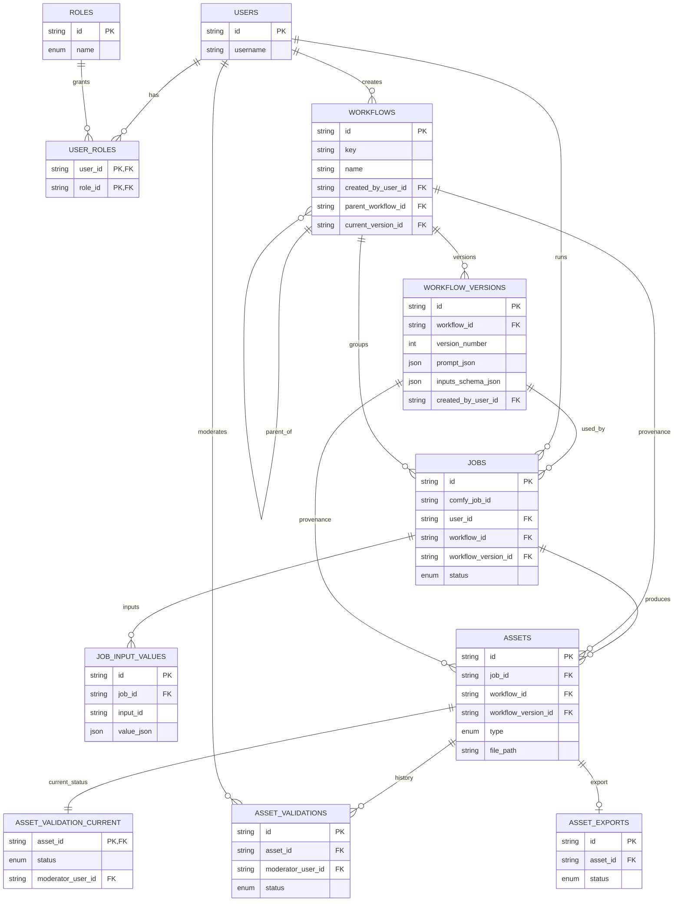

# Backend UML (Mermaid)

```mermaid
erDiagram
    USERS ||--o{ USER_ROLES : has
    ROLES ||--o{ USER_ROLES : grants

    USERS ||--o{ WORKFLOWS : creates
    WORKFLOWS ||--o{ WORKFLOW_VERSIONS : versions
    WORKFLOWS ||--o{ WORKFLOWS : parent_of
    WORKFLOW_VERSIONS ||--o{ JOBS : used_by

    USERS ||--o{ JOBS : runs
    WORKFLOWS ||--o{ JOBS : groups

    JOBS ||--o{ JOB_INPUT_VALUES : inputs
    JOBS ||--o{ ASSETS : produces

    WORKFLOWS ||--o{ ASSETS : provenance
    WORKFLOW_VERSIONS ||--o{ ASSETS : provenance

    ASSETS ||--o{ ASSET_VALIDATIONS : history
    ASSETS ||--|| ASSET_VALIDATION_CURRENT : current_status
    USERS ||--o{ ASSET_VALIDATIONS : moderates

    ASSETS ||--o| ASSET_EXPORTS : export

    USERS {
        string id PK
        string username
    }

    ROLES {
        string id PK
        enum name
    }

    USER_ROLES {
        string user_id PK, FK
        string role_id PK, FK
    }

    WORKFLOWS {
        string id PK
        string key
        string name
        string created_by_user_id FK
        string parent_workflow_id FK
        string current_version_id FK
    }

    WORKFLOW_VERSIONS {
        string id PK
        string workflow_id FK
        int version_number
        json prompt_json
        json inputs_schema_json
        string created_by_user_id FK
    }

    JOBS {
        string id PK
        string comfy_job_id
        string user_id FK
        string workflow_id FK
        string workflow_version_id FK
        enum status
    }

    JOB_INPUT_VALUES {
        string id PK
        string job_id FK
        string input_id
        json value_json
    }

    ASSETS {
        string id PK
        string job_id FK
        string workflow_id FK
        string workflow_version_id FK
        enum type
        string file_path
    }

    ASSET_VALIDATIONS {
        string id PK
        string asset_id FK
        string moderator_user_id FK
        enum status
    }

    ASSET_VALIDATION_CURRENT {
        string asset_id PK, FK
        enum status
        string moderator_user_id FK
    }

    ASSET_EXPORTS {
        string id PK
        string asset_id FK
        enum status
    }
```
